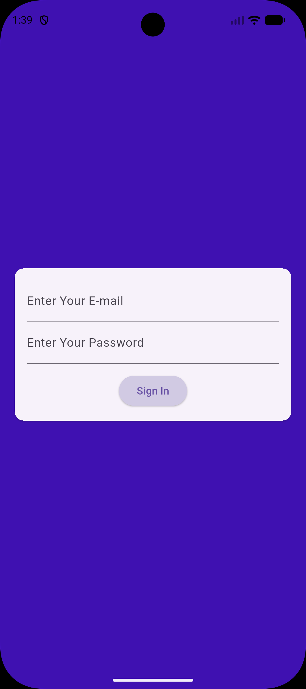
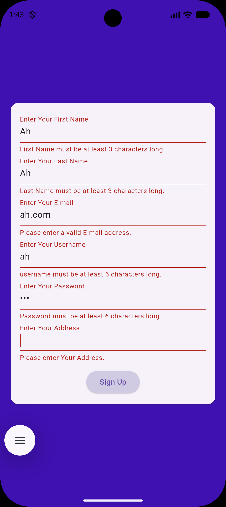
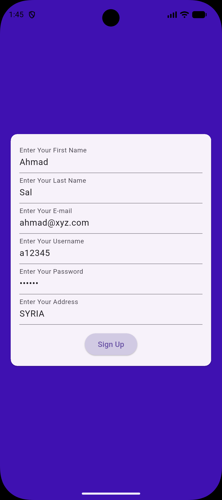
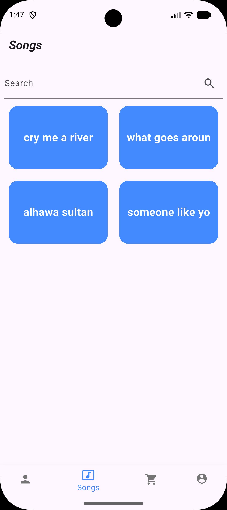
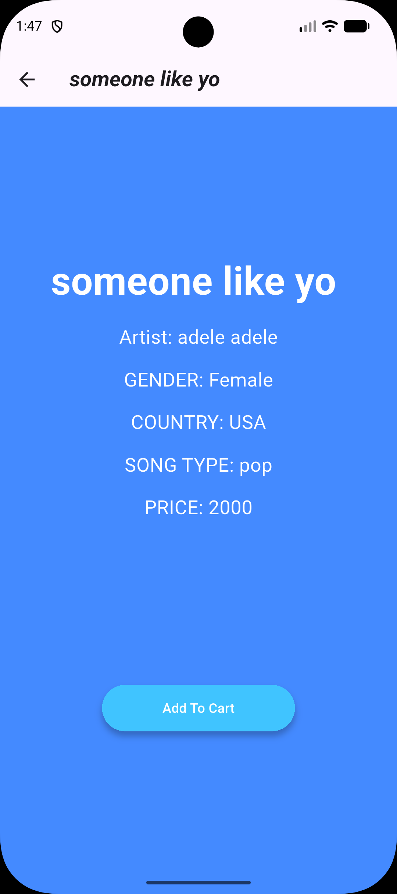
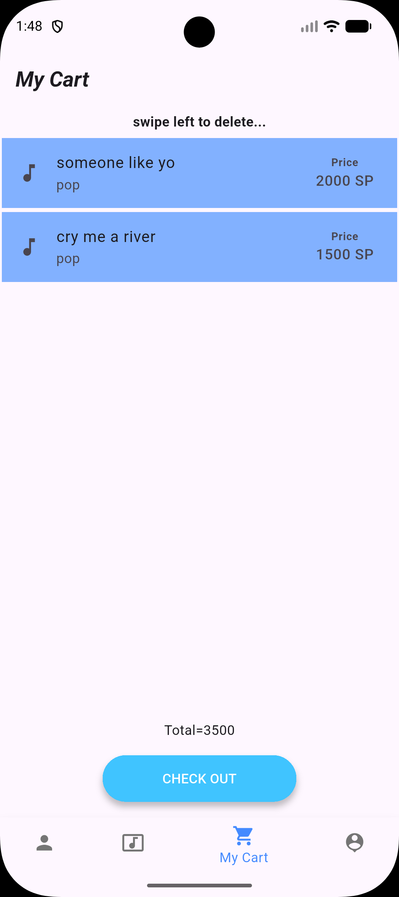
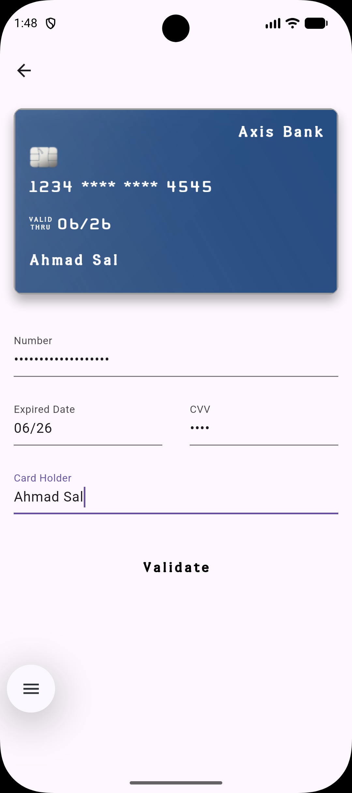
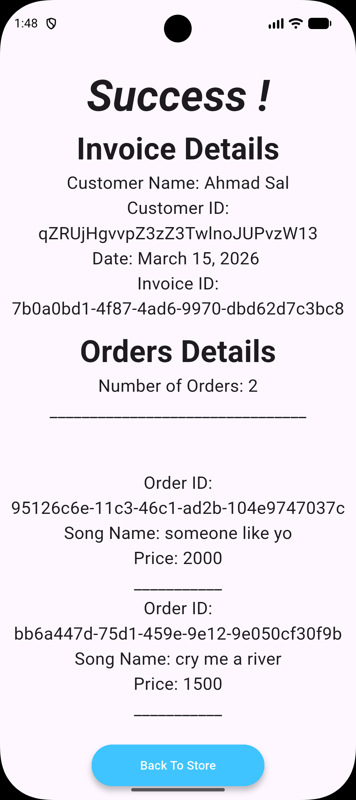

# Flutter Music Store 🎵

A cross-platform **Music Store mobile application** built using Flutter and Firebase.
The app allows users to browse songs, view details, add songs to a cart, simulate checkout, and generate an invoice.

---

## Features

* User Authentication (Sign In / Sign Up)
* Form validation for all input fields
* Browse artists and songs
* Search songs
* Song details page
* Add songs to cart
* Swipe to remove items from cart
* Checkout and payment simulation
* Invoice and order generation
* User profile management
* Persistent login session

---

## Technologies

* Flutter
* Dart
* Firebase Authentication
* Cloud Firestore
* Material Design

---

## Platforms

* Android
* iOS

---

## Screenshots

### Authentication

Login Screen

Signup Validation

Signup Screen

---

### Browse Music

Songs List

Song Details

---

### Cart & Checkout

Shopping Cart

Payment Screen

Invoice Screen

---

## Installation

Clone the repository

git clone https://github.com/ahmad007sa/flutter-music-store.git

Navigate to the project folder

cd flutter-music-store

Install dependencies

flutter pub get

Run the app

flutter run

---

## Author

Ahmad Salameh
