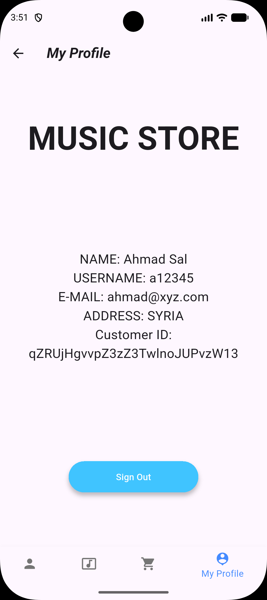

# Flutter Music Store 🎵


A cross-platform **Music Store mobile application** built using Flutter and Firebase.

The app allows users to browse artists and songs, add music to a cart, simulate a checkout process, and generate invoices after purchase.
It also includes an **Admin Panel** for managing the music catalog.

---

## Download

You can download the latest APK from the GitHub releases page.

[Download APK](https://github.com/ahmad007sa/flutter-music-store/releases)

---

## Features

### User Features

* User Authentication (Sign In / Sign Up)
* Form validation for all input fields
* Browse artists and songs
* Search songs
* Song details page
* Add songs to cart
* Swipe to remove items from cart
* Checkout and payment simulation
* Invoice generation after purchase
* User profile management
* Persistent login session

### Admin Features

* Admin authentication
* Add new artists
* Add new songs
* Delete songs and artists
* Manage the music catalog

Admin access is granted based on **Firebase Authentication UID**.

---

## Technologies

* Flutter
* Dart
* Firebase Authentication
* Cloud Firestore
* Material Design

---

## Platforms

* Android
* iOS

---

## Screenshots

### Authentication

<p align="center">
  
  
  
</p>

Login, account creation, and form validation.

---

### Music Browsing

<p align="center">
  
  
  
</p>

Browse artists, explore songs, and view song details.

---

### Shopping Flow

<p align="center">
  
  
  
</p>

Add songs to cart, simulate payment, and generate invoices.

---

### User Profile

<p align="center">
  
</p>

User account information and profile management.

---

### Admin Panel

<p align="center">
  
</p>

Admin users can manage the music catalog by adding or deleting artists and songs.

---

## Admin Setup

To enable admin access in the application:

1. Create a **Firebase project**.
2. Connect the Firebase project with the Flutter application.
3. Create a user account inside the app.
4. Open **Firebase Authentication**.
5. Copy the **UID** of the user you want to grant admin privileges.

Then open the file:

lib/pages/viewpage.dart

Find the admin check function and replace the UID with your own.

Example:

```
void checkAdmin() {
  user != null
      ? user!.uid == 'ADMIN_USER_UID'
          ? admin = true
          : admin = false
      : null;
}
```

Replace `ADMIN_USER_UID` with the UID copied from Firebase Authentication.

---

## Installation

Clone the repository

git clone https://github.com/ahmad007sa/flutter-music-store.git

Navigate to the project folder

cd flutter-music-store

Install dependencies

flutter pub get

Run the app

flutter run

---

## Project Structure

```
lib/
 ├── models
 ├── pages
 ├── widgets
 └── main.dart
```

---

## Author

Ahmad Salameh
